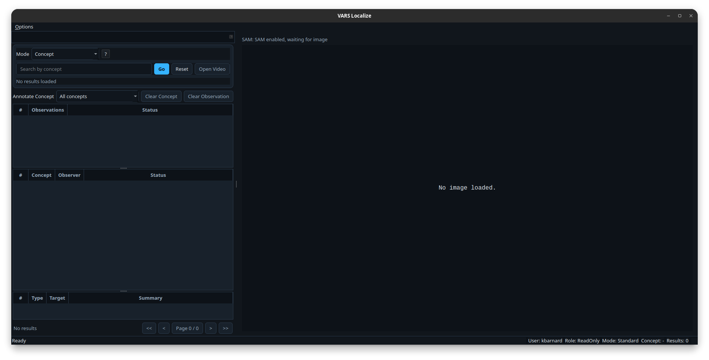

# VARS Localize Documentation

VARS Localize is a PyQt desktop application for creating and editing observation localizations (bounding boxes) in VARS.

This documentation is organized for:

- Operators and annotators who use the UI daily.
- Maintainers configuring app behavior and SAM3 assistance.
- Developers extending the codebase.

## What You Can Do in VARS Localize

- Authenticate against M3 and load concept data.
- Search by concept or UUID-based modes.
- Review imaged moments, observations, and associations.
- Draw, edit, resize, and delete localization boxes.
- Filter and focus annotation activity by concept.
- Use optional SAM3-assisted candidate generation.

## UI At A Glance

The app has two primary regions:

- Left dock: Search and entry browser.
- Main panel: Image canvas and localization tools.

<!-- ### Screenshot Placeholder: Full Application Window

 -->

!!! note "Capture checklist"
    - Include the full application window.
    - Keep menu bar, status bar, and both panels visible.
    - Use a representative loaded imaged moment.

## Documentation Map

- Start with [Installation](getting-started/installation.md).
- Follow [Quickstart](getting-started/quickstart.md) for the shortest path to first localization.
- Use [User Guide](user-guide/ui-overview.md) for full UI walkthrough.

## Scope and Assumptions

- You have access to an M3 endpoint.
- You can authenticate with valid VARS credentials.
- Optional SAM3 flows require local model setup.
